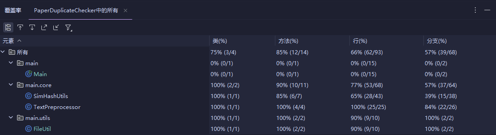

# 软件工程作业02

| Info |                         Detail                          |
|:----:|:-------------------------------------------------------:|
|  学号  |                       3123004449                        | 
| 仓库链接 | 🔗[Github仓库传送门](https://github.com/lin-snow/3123004449) |

---

# 如何使用？

使用**相对路径**：

```
java -jar Main.jar <原版文件路径> <抄袭文件路径> <答案文件路径>
```

---

# PSP2.1

| PSP2.1                                    | Personal Software Process Stages | 预估耗时（分钟） | 实际耗时（分钟） |
|:------------------------------------------|:---------------------------------|:--------:|:--------:|
| **Planning**                              | 计划                               |          |          |
| · _Estimate_                              | 估计这个任务需要多少时间                     |    60    |    60    |
| **Development**                           | 开发                               |          |          |
| · _Analysis_                              | 需求分析 (包括学习新技术)                   |   120    |   115    |
| · _Design Spec_                           | 生成设计文档                           |    90    |   126    |
| · _Design Review_                         | 设计复审                             |    30    |    56    |
| · _Coding Standard_                       | 代码规范 (为目前的开发制定合适的规范)             |    60    |    45    |
| · _Design_                                | 具体设计                             |   120    |   130    |
| · _Coding_                                | 具体编码                             |   120    |   110    |
| · _Code Review_                           | 代码复审                             |    60    |    60    |
| · _Test_                                  | 测试（自我测试，修改代码，提交修改）               |   180    |   230    |
| **Reporting**                             | 报告                               |          |          |
| · _Test Report_                           | 测试报告                             |    90    |   100    |
| · _Size Measurement_                      | 计算工作量                            |    30    |    20    |
| · _Postmortem & Process Improvement Plan_ | 事后总结, 并提出过程改进计划                  |    60    |    75    | 
| **Total**                                 | 合计                               |   1020   |   1127   |

---

# 设计与实现
## 项目结构

```shell


├─data # 测试数据
│      ans.txt # 答案输出文件
│      org.txt # 原文
│      org_add.txt # 抄袭版
│      org_add1.txt # 另一份抄袭版
│
├─src # 项目源代码
│  └─main
│      │  Main.java # 入口文件
│      │
│      ├─core
│      │      SimHashUtils.java # SimHash算法实现
│      │      TextPreprocessor.java # 文本预处理模块
│      │
│      └─utils
│              FileUtil.java # 文件读写工具类
│
└─test # 项目测试模块 （基于Junit5）
    └─main
        ├─core
        │      SimHashUtilsTest.java # SimHash模块单元测试
        │      TextPreprocessorTest.java # TextPreprocessor模块单元测试
        │
        └─utils
                FileUtilsTest.java # 文件读写工具类单元测试

```

---

## 关键函数流程

### 生成SimHash


---

### 计算Jaccard相似度


---

### 分词

---

### 文本预处理


## 算法关键 / 独到之处

我的算法创新性地融合了 `SimHash 和 Jaccard 相似度（权重 0.4 : 0.6）`，
在文本相似性检测中实现了高精度与高效率的平衡。
通过 Bigram 分词 和 标准化预处理（如全角转半角、噪声移除），特征提取更鲁棒，特别适合中英文混合文本。
SimHash 利用 词频加权 和 128 位哈希 快速捕捉全局结构，Jaccard 精准衡量局部重叠，二者结合显著提升了相似度计算的准确性，尤其擅长处理“伪装相似”文本。

算法设计高效且灵活，采用模块化结构，支持调整权重和 N-Gram 大小，适用于文章查重、内容推荐等场景。
128 位 SimHash 确保了大规模数据处理的高效性，预处理和空输入优化进一步提升了性能，兼顾实用性和扩展性。

---

# 改进
## 性能分析图
### CPU Flame Graph


**CPU 消耗分析:**
主要瓶颈：genSimHash 方法是 CPU 消耗的主要来源。
**原因：**
哈希计算密集：该方法对每个 Bigram 特征进行 MD5 哈希计算，这是一个 CPU 密集型操作。
循环次数多：文本越长，生成的 Bigram 数量越多，导致哈希计算次数显著增加。
权重合并：对 128 位向量进行加权合并，涉及大量浮点运算，进一步加重 CPU 负担。
**改进建议：**
使用更轻量级的哈希算法（如 MurmurHash）替代 MD5，或减少哈希位数（例如 64 位）。
将 Bigram 的哈希计算并行化，利用多核 CPU 提高效率。
对重复的 Bigram 缓存哈希结果，避免不必要的重复计算。

---

### Memory Usage Graph


**内存消耗分析:**
主要瓶颈：genSimHash 方法在处理长文本时占用大量内存。
**原因：**
Bigram 数组：长文本生成的 Bigram 数组会占用大量内存空间。
频率 Map：计算特征频率时生成的 Map 会随着 Bigram 数量增加而变大。
哈希向量：生成的 128 位浮点数向量也需要一定的内存。
**改进建议：**
对超长文本采用流式处理，逐步生成 SimHash，避免一次性加载所有数据。
减少特征数量，例如使用 3-Gram 替代 Bigram，降低内存占用。
使用稀疏矩阵等高效数据结构存储频率 Map，优化内存使用。

---

# 单元测试



所有测试用例均通过，平局覆盖率为83.5%，符合要求。

---

## SimHashUtils单元测试


**部分单元测试代码：**


**构造测试数据的思路：**
- **目的**：验证方法能否正确计算文本相似度。
- **方法**：用 "Hello World" 和 "Hello Java" 生成 SimHash 值，然后计算相似度。
- **预期**：结果应在 0 到 1 之间，大于 0（有相似性），小于 1（不完全相同）。


## Fileutil单元测试


## TextPreprocessor单元测试


---

# 异常处理
## 1. FileNotFoundException
**设计目标:**
`FileNotFoundException` 的设计目标是确保程序在尝试读取或写入文件时，目标文件必须存在。如果文件不存在，程序会抛出此异常，从而避免后续操作因文件缺失而失败。这种异常通常发生在文件路径错误、文件被删除或未创建的情况下。通过捕获 FileNotFoundException，我们可以提示用户检查文件路径或重新生成文件，从而提高程序的容错性。


**错误场景:**
**场景**：尝试读取一个不存在的文件 non_existent_file.txt。
**结果**：控制台输出“找不到文件：non_existent_file.txt”，方法返回空字符串。测试通过，验证了异常被捕获并处理的默认行为。

---

## 2. IOException
**设计目标:**
`IOException` 的设计目标是捕获和处理文件输入输出（I/O）操作中的各种潜在错误。这些错误可能包括但不限于：磁盘空间不足、文件权限不足、设备故障等。它的作用是提供一个通用的异常处理机制，让程序能够在 I/O 操作失败时优雅地退出或采取补救措施，而不会直接崩溃。


**错误场景:**
**场景**：程序向一个只读文件 readonly.txt 写入新内容。
**结果**：控制台输出“IO错误: …”，文件内容保持为“Initial content”。测试通过，验证了 IOException 被捕获且未影响程序运行。